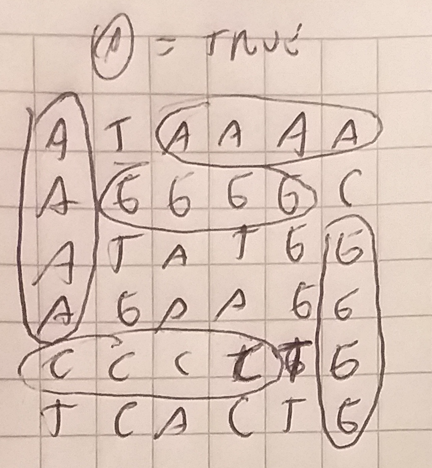
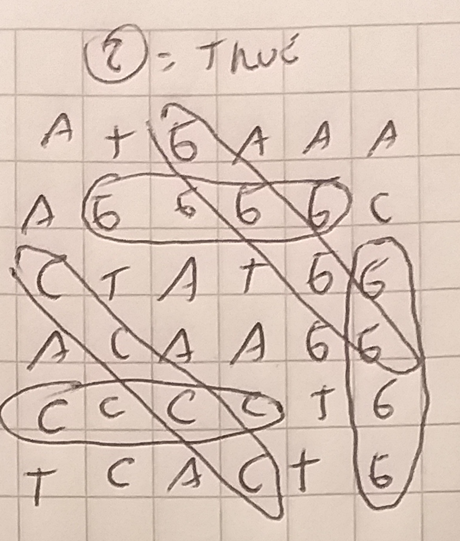
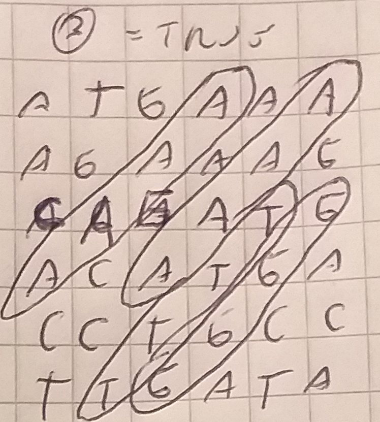
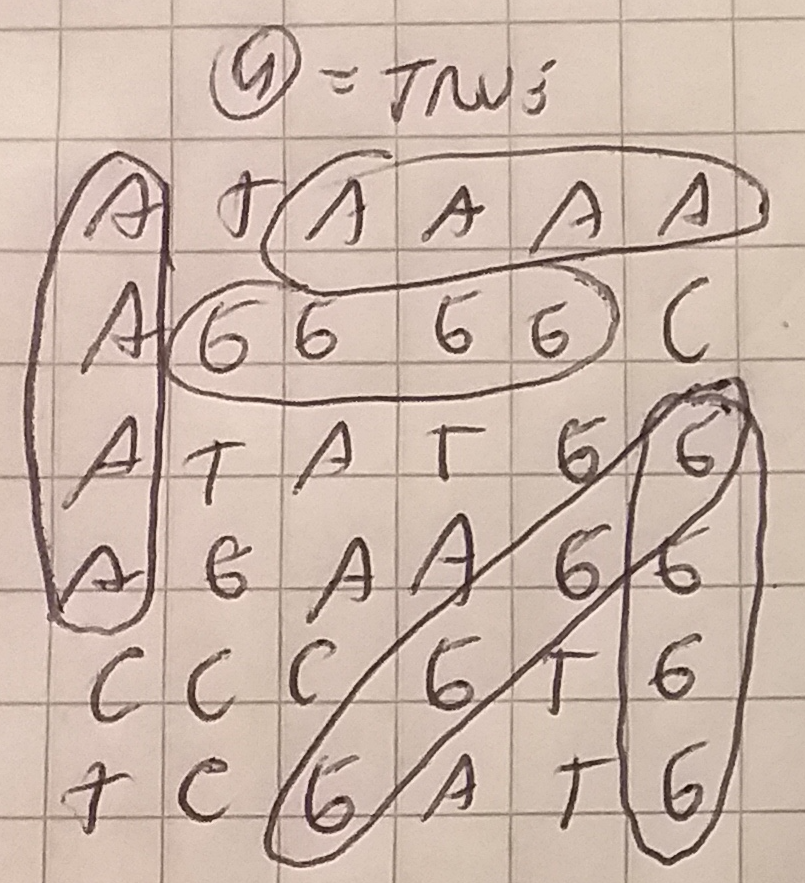
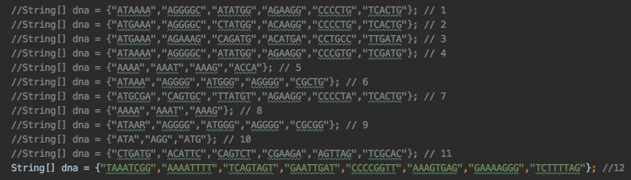

# Ejercicio MercadoLibre Nivel 1 (Agosto 2019)
###### Autor: [Manuel Moya - mmoyam@gmail.com]
El objetivo de este documento es detallar la resolución del caso MercadoLibre, donde se debe diseñar un algortimo que detecte mutantes basados su secuencia de ADN que será entregado.

### Enunciado

* Crear un programa con un método o función con la siguiente firma:

	**boolean isMutant(String[] dna);**

* En donde recibirás como parámetro un array de Strings que representan cada fila de una tabla
de (NxN) con la secuencia del ADN. 
* Las letras de los Strings solo pueden ser: (A,T,C,G), las
cuales representa cada base nitrogenada del ADN.
* Un humano es mutante, si encuentras más de una secuencia de cuatro letras iguales​, de forma oblicua, horizontal o vertical.
* Ejemplo (Caso mutante):

	**String[] dna = {"ATGCGA","CAGTGC","TTATGT","AGAAGG","CCCCTA","TCACTG"};**

* En este caso el llamado a la función isMutant(dna) devuelve “true”.
* Desarrolla el algoritmo de la manera más eficiente posible.

### Entregable

Programa (java) que cumpla con el método solicitado

### Idea principal

* Dividir el problema en 4 subproblemas con los cuales se pueda abordar todas las secuencias de ADN: 
	1. Encontrar secuencias horizontales.
	2. Encontrar secuencias verticales.
	3. Encontrar secuencias diagonales de Izquierda a derecha.
	4. Encontrar secuencias diagonales de Derecha a izquierda.
* Solución inspirada en algoritmo goloso (greedy), es decir, cada vez que encuentre una secuencia evaluar si existe una solución, de esta forma logrando eficiencia en el algoritmo.
* Como la estructura de datos es una matriz NxN, el objetivo es desarrollar el algoritmo con complejidad polinomial, que para este caso es O(n^2)

### Idea secundaria
Usar programación dinámica para dividir en subproblemas, es decir, 

* Recorrer toda la matriz y evaluar secuencias de adn (horizontal, vertica o diagonal) para cada posición
* En cada posición que resuelva una secuancia, evaluar si llegó a la solución final.

### Consideraciones

### Descripción del programa

El programa considera un solo archivo llamado [Mutant.java](https://github.com/manumoya/MerLibNiv1/blob/master/src/Mutant.java), el cual contiene los siguientes métodos:

* **completeMatriz (char[][] arr, String[] dna )**: LLena la matriz nxn con las secuencias de entrada, validando que sea una matriz correcta.
* **valideLetter(char [] dnaSimple)**: Valida que las letras sean las correspondientes.
* **countSecuenceHoriz (char[][] arr, int lenghMatriz)**: Cuenta las secuencias horizontales.
* **countSecuenceVert (char[][] arr, int lenghMatriz)**: Cuenta las secuencias verticales.
* **countSecuenceDiagIzqDer (char[][] arr, int lenghMatriz)**: Cuenta secuencias diagonales de izquierda a derecha.
* **countSecuenceDiagDerIzq (char[][] arr, int lenghMatriz)**: Cuenta secuencias diagonales de derecha a izquierda.
* **isMutant(String[] dna)**: Evalúa si la secuencia de ADN es mutante o no.
* **main(String[] args)**: Métodos principal de la ejecución del programa.

### Análisis del programa
* La solución se comporta según lo esperado para todos los casos de pruebas utilizados.
* La complejidad de cada método es la que se indica a continuación, donde nxn = n^2

| Descripción  | Método  | Complejidad  |
|---|---|---|
| Cargar matriz con ADN | completeMatriz() | n^2|
| Encontrar secuencias horizontales  | countSecuenceHoriz() | n^2|  
| Encontrar secuencias verticales  | countSecuenceVert() |  n^2 |
| Encontrar secuencias diagonales Izq. a Der. | countSecuenceDiagIzqDer() | n^2 |
| Encontrar secuencias diagonales Der. a Izq. | countSecuenceDiagDerIzq() | n^2 |

* Por lo anterior la complejidad es: n^2 + n^2 + n^2 + n^2 + n^2 = 5n^2 = O(n^2). Logrando complejidad polinomial, que para este caso es cuadrática.

### Traza
Los siguientes casos fueron probados en las pruebas

|Caso 1 = true | Caso 2 = true | Caso 3 = true | Caso 4 = true |
|---|---|---|---|
|  |  |  |  |
|Caso 5 = true| Caso 6 = true | Caso 7 = true | Caso 8 = false |
|  |  |  |  |
| Caso 9 = false | Caso 10 = false | Caso 11 = false | Caso 12 = true |
|  |  |  |  |

Los cuales se representan en el código:

### ¿Se puede mejorar?

Se puede mejorar, entregando a cada análisis la cantidad de secuencia de ADN encontrada en el análisis anterior, de esta forma evita hacer procesamiento adicional. Es decir, si existe una secuencia vertical, basta que encuentre una horizonatal (o diagonal) para que sea mutante.